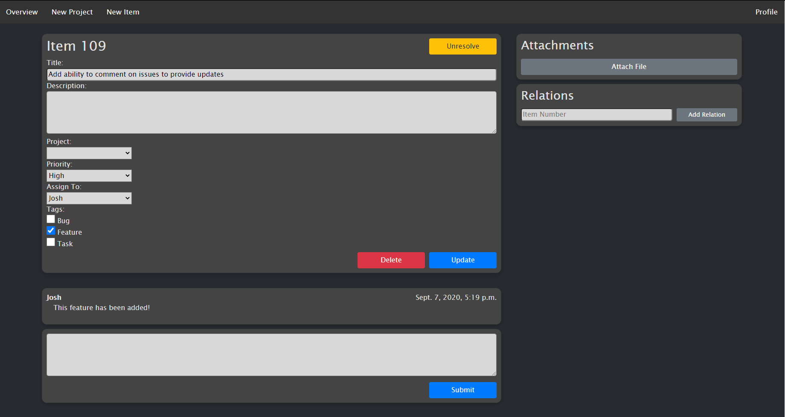

# Dragonfly
A an item-tracking web interface made with Django. Basic Features:

* Bug/Feature/Task tracking
* Assignment of items to different users
* Creating "Projects" which group together like items
* Uploading files to items
* Relating items to each other
* Adding comments to items

